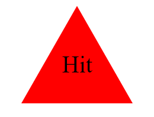

# SVG Logo Maker

Craft personalized SVG logos effortlessly with this logo generator. The SVG Logo Maker simplifies the logo creation process by guiding you through a few simple questions to craft a unique representation of your brand or personal style.

- View the GitHub [repository](https://github.com/Thomas-Barnhart/SVG-Logo-Maker)

## Table of Contents

- [About the Project](#about-the-project)
  - [Usage](#usage)

- [Getting Started](#getting-started)

- [Live Demo](#live-demo)

- [License](#license)
- [Roadmap](#roadmap)
- [Contribute](#contribute)
- [Contact Information](#contact-information)

## About the Project

The SVG Logo Maker is a personalized logo generator that streamlines the logo creation process. By guiding users through a series of simple questions, the generator helps craft unique and meaningful SVG logos tailored to your brand or personal style. This project leverages modern web technologies to provide an intuitive and interactive logo creation experience.

### Usage

Create your personalized SVG logo in a few easy steps. Launch the SVG Logo Maker and answer a series of questions to define the elements, colors, and style of your logo. The generator will dynamically create an SVG representation based on your inputs, allowing you to preview and download your custom logo.

## Getting Started

To use the SVG Logo Maker locally, follow these steps:

1. Clone this repository to your local machine.
2. Install dependencies by running `npm install`.
3. Launch the application with `npm start`.

## Live Demo

Check out the live demo of the SVG Logo Maker at .

### License

This project is licensed under the MIT License. See the [LICENSE](https://github.com/Thomas-Barnhart/SVG-Logo-Maker/blob/main/LICENSE) file for details.

## Roadmap

There are currently <u><b>NO</b></u> open issues. Visit the [issues](https://github.com/Thomas-Barnhart/SVG-Logo-Maker/issues) page on GitHub for updates.

## Contribute

Contributions to enhance this project are welcome. If you plan to make significant changes, please open an issue to discuss your proposed alterations.

## Contact Information

For any inquiries, reach out via email at tmbarnhart1@gmail.com.

GitHub Page: [Thomas-Barnhart](https://github.com/Thomas-Barnhart)
